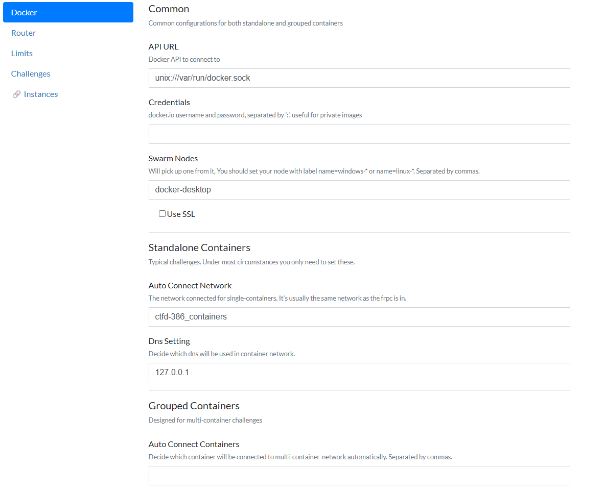
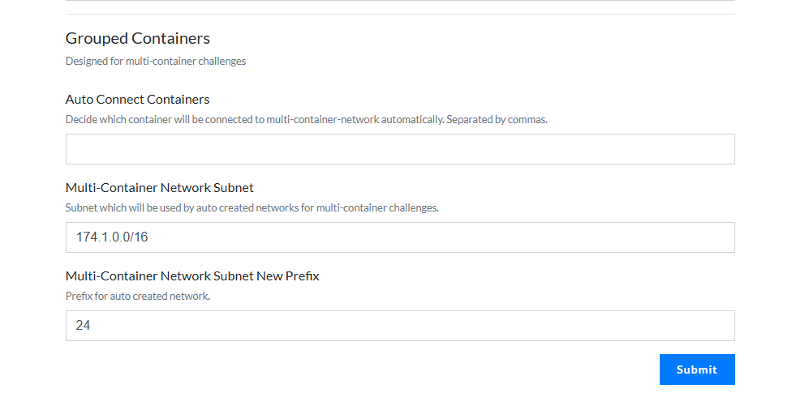
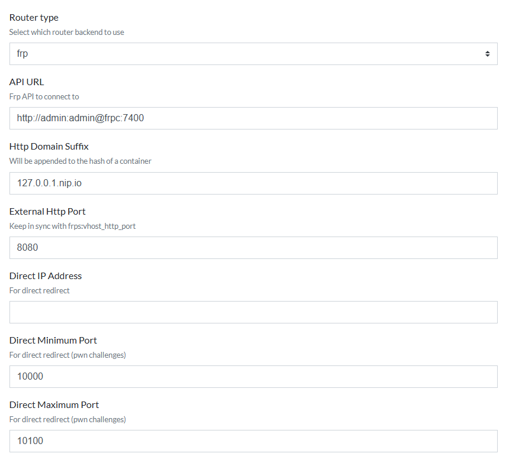

# ExploitX: Into The Void - CTFd Deployment

This repository contains the custom **CTFd** deployment used for the ExploitX "Into The Void" event. It has been heavily modified from the vanilla CTFd framework to support dynamic, on-demand Dockerized challenges, advanced anti-cheat systems, and a fully custom futuristic theme.

## Features

- **Dynamic Container Challenges (CTFd-Whale)**: Players can spin up private, isolated Docker instances for challenges using the CTFd-Whale plugin and an `frp` networking stack.
- **Flag Sharing Detector**: A custom proprietary plugin that tracks dynamic flags generated by `ctfd-whale`. If Team A submits a flag generated for Team B's container instance, they are instantly flagged for cheating.
- **Custom Theme**: Features the bespoke "Into The Void" dark-mode futuristic theme with dynamic elements and customized scoring pages.
- **Discord Integrations**: Automated webhooks broadcast First Bloods, solves, and announcements directly to Discord.
- **Single Use Tokens**: A plugin for distributing one-time-use registration tokens to control player entry.
- **Wave Challenges**: Scheduled release of challenges based on event waves.

## Interface Screenshots

Here is a glimpse of the custom "Into The Void" theme in action:

<div align="center">
  
  
  
</div>

## Prerequisites

Because the dynamic challenge infrastructure requires a secure overlay network to route traffic between the challenge containers and the `frps` router, your Docker engine **must have Swarm mode enabled**.

1. **Docker** and **Docker Compose** installed.
2. **Docker Swarm Initialized**:
   ```bash
   docker swarm init
   ```
   *(If it says "This node is already part of a swarm," you are good to go).*

## Installation & Deployment

Deploying the CTF is extremely simple. The entire infrastructure is managed via Docker Compose.

1. Clone the repository and navigate into it:
   ```bash
   git clone https://github.com/Osama-Yusouf/CTFd-Whale-Deployment.git
   cd CTFd-Whale-Deployment
   ```

2. Initialize Docker Swarm (if not already done):
   ```bash
   docker swarm init
   ```

3. Spin up the environment:
   ```bash
   docker-compose up -d
   ```

It will take approximately 15-30 seconds for the MariaDB database to initialize and the CTFd `gunicorn` workers to boot. Once ready, the platform will be accessible at:
**`http://localhost`**

*(Make sure port 80 and 8000 are not being used by other applications on your system before running).*

## Architecture

The `docker-compose.yml` orchestrates the following services:
- **`ctfd`**: The main Python Flask web application.
- **`db`**: MariaDB instance storing all CTF data (ignored by git).
- **`cache`**: Redis instance for caching.
- **`nginx`**: Reverse proxy mapping traffic to port 80.
- **`frps` / `frpc`**: Fast Reverse Proxy server and client. These manage the dynamic routing of TCP ports from the player-generated Docker containers back to the public internet/local network.

## Administration

Please see [Instructions.md](Instructions.md) for detailed admin procedures, including how to create dynamic Docker challenges, configure Discord webhooks, and utilize the cheat detection dashboards.

---
**Author**: Osama Yusouf
